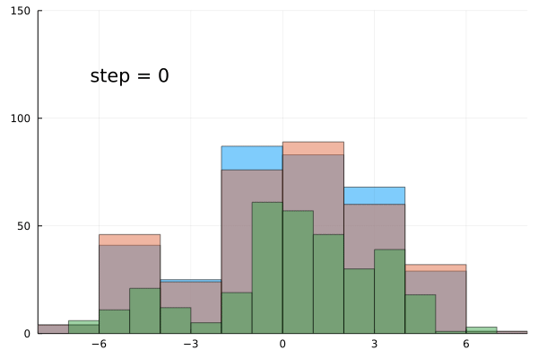

# HierarchicalDirichletProcess

This repository contains useful functions for generating from a Dirichlet/Hierarchical Dirichlet Process. 
The code is largely adapted from the excellent [tutorials](https://dp.tdhopper.com/) by Tim Hopper.

